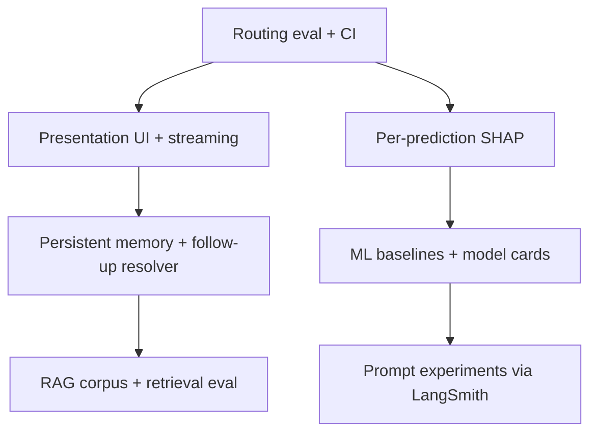

# Future Work

This document outlines planned improvements beyond the current POC scope. It is intended for reviewers evaluating the submission: what was deliberately deferred, why, and how the system would evolve toward a production-ready clinical analytics assistant.

**Companion docs:** [SUBMISSION.md](SUBMISSION.md) (what was built) · [ARCHITECTURE.md](ARCHITECTURE.md) (system design)

---

## Executive summary

The POC demonstrates end-to-end behavior across ML inference, multi-agent orchestration, dataset analytics, and document retrieval. The highest-impact next steps are:

1. **Routing evaluation and regression testing** — systematic measurement before further prompt or heuristic changes
2. **User-facing presentation layer** — move from debug-oriented UI to analyst-ready output
3. **Streaming responses** — reduce perceived latency on multi-step turns
4. **Richer model explanations** — per-prediction SHAP and clearer separation of dataset statistics vs model drivers
5. **Memory persistence and follow-up resolution** — durable sessions and smarter context inheritance
6. **ML quality** — stronger baselines, feature work, and documented model cards

---

## 1. Orchestration and routing

### Current state

Routing operates at three levels:

| Layer | Location | Mechanism |
|-------|----------|-----------|
| Orchestrator | `src/agents/orchestrator.py` | Keyword signals + LLM `RoutingDecision` |
| Multi-step planner | `src/agents/multi_step.py` | Rule-based `detect_required_agents()` + LLM plan |
| Data task classifier | `src/agents/tools/data_task_classifier.py` | Heuristics for `sql` / `chart` / `insight` |

This hybrid approach was appropriate for a time-boxed POC: fast to implement, interpretable, and testable in isolation. It is also inherently fragile — overlapping signals (e.g. `compare`, `distribution`, `what are the`) require manual fixes and targeted unit tests.

### Proposed improvements

**Golden evaluation dataset**

Convert the assignment prompts and extended test matrix (see [SUBMISSION.md](SUBMISSION.md)) into a structured eval set (`tests/eval/routing_cases.yaml`) with expected:

- `route` — `prediction` / `data` / `rag` / `fallback`
- `required_agents` — for multi-step requests
- `data_task` — `sql` / `chart` / `insight` where applicable
- `requires_clarification` — boolean

Run this in CI as a regression gate on every orchestrator change.

**Two evaluation modes**

| Mode | Purpose | Cost |
|------|---------|------|
| Deterministic | Exact route and tool match | Low — suitable for CI |
| LLM-as-judge | Synthesis quality, grounding, tone | Higher — prompt tuning loop |

Integrate with **LangSmith datasets and experiments** to compare prompt versions on recorded traces.

**Routing architecture (medium term)**

- Consolidate growing keyword lists into a single intent classifier (structured output or fine-tuned model)
- Apply confidence thresholds: prefer clarification over mis-routing
- Unify orchestrator routing and data-task classification under one eval framework

Orchestration is not only agent selection — it includes execution order, when to synthesize multi-step results, and when to pause for user clarification. All of these deserve explicit evaluation.

---

## 2. Insights and model explanations

### Current state

The insight tool (`src/agents/tools/insight_tool.py`) loads **offline** SHAP summaries and feature-importance JSON produced by `ml.train`. An LLM synthesizes prose from pre-computed rankings. This is fast, deterministic, and grounded — but flat: global model-level drivers only.

### Proposed improvements

| Capability | Description | Priority |
|------------|-------------|----------|
| **Per-prediction SHAP** | Explain why a specific patient received a given COPD class or ALT value | High |
| **Global SHAP** (existing) | Population-level feature drivers | Done |
| **Cohort / subgroup insight** | Filter cohort via SQL, then compute subgroup importance | Medium — higher latency |
| **Dataset correlations** | Descriptive stats (e.g. BMI vs ALT in the CSV) | Medium — distinct from model explanation |
| **Partial dependence / ICE** | Offline visual artifacts for nonlinear relationships | Lower |

**Important distinction for the UI:** dataset correlation (descriptive) must be presented separately from SHAP (model explanation). Users often conflate the two; clear labeling improves trust.

**Per-prediction SHAP** is the most natural next step: the prediction pipeline already materializes `used_features`; TreeSHAP on a single row is fast for the current model types. This would link prediction and explanation in one coherent answer.

**Hybrid strategy:** cache global insights offline; compute per-patient explanations on demand after inference.

---

## 3. Streaming output

### Current state

`POST /chat` is synchronous. The Streamlit UI blocks until the full LangGraph run completes (up to 120s timeout). Multi-step turns may involve several LLM calls (route → extract → tool → synthesize → multi-step synthesize), leaving the user with no feedback during execution.

### Proposed improvements

Introduce `POST /chat/stream` (SSE) or WebSocket, streaming in priority order:

1. **Status events** — e.g. "Routing to data agent…", "Executing SQL…", "Rendering chart…"
2. **Structured blocks** — chart JSON and prediction details as soon as tools complete
3. **Token stream** — final synthesis text via LangGraph `astream_events` or chat model callbacks

LangGraph supports event streaming natively; this is an incremental API and UI change, not a rewrite.

---

## 4. End-user presentation (beyond debug UI)

### Current state

The Streamlit UI (`ui/app.py`) prioritizes **observability**: sidebar shows agent, tool, and expandable JSON (`used_features`, `defaults_used`, artifact paths). This is valuable for review and debugging but not appropriate for a clinical analyst audience.

### Proposed improvements

| Current | Target |
|---------|--------|
| `can_predict = True` in captions | Plain-language confidence and missing-field messaging |
| JSON in expanders | Structured cards: prediction, probability bars, top drivers |
| Chart in sidebar block | Inline chart in the main conversation |
| Agent/tool always visible | Hidden by default; "Show details" for power users |
| Multi-step specialist outputs | Single coherent narrative |

**Separation of concerns:** maintain a **presentation schema** (what the analyst sees) distinct from a **debug schema** (sidebar, LangSmith, API `details` fields). The API already exposes structured `ChatPredictionDetails`, `ChatChartDetails`, etc. — the gap is rendering, not data model.

---

## 5. Data exploration and model quality

### Current state

Models are trained in `src/ml/train.py` (XGBoost for COPD multiclass, Ridge for ALT regression) over a reduced feature set informed by EDA. Holdout COPD accuracy is near random baseline for four classes (~25%), documented in training metadata. The POC prioritizes pipeline integration over predictive performance.

### Proposed improvements

1. **Revisit EDA** with focus on predictive power, not only distributions
2. **Baseline ladder** — majority class → logistic regression → tree ensembles; document each step
3. **Systematic feature selection** — mutual information, SHAP-based ablation, interaction terms
4. **Target formulation** — consider ordinal COPD encoding or binary severe/mild split; log-transform ALT with outlier handling
5. **Model cards** — holdout metrics, calibration plots, confusion matrix, feature list, and known limitations in `artifacts/`

Strong chat orchestration cannot compensate for unreliable predictions. ML quality is a production blocker and should be tracked alongside routing eval metrics.

---

## 6. Experimentation framework

Structured experimentation depends on the evaluation infrastructure in §1. Without measured baselines, prompt and architecture changes are difficult to justify.

| Domain | Current | Experiments |
|--------|---------|-------------|
| LLM models | Separate routing and synthesis models (`config.py`) | Cheaper routing model; stronger synthesis model; cost/latency trade-offs |
| RAG chunking | Fixed chunking at index time | Chunk size, overlap, semantic vs fixed splits, metadata filters |
| Embeddings | Single embedding model | Retrieval precision (MRR, hit@k on golden questions) |
| Prompts | Hand-written system prompts per agent | LangSmith A/B experiments; few-shot examples |
| Context window | Fixed turn/step windows (`memory_max_turns`) | Summarized session memory instead of raw transcript truncation |
| Latency | 3–5 LLM calls per complex turn | Parallel retrieval + SQL; cache insight artifacts; template-only paths where synthesis adds little value |

**Context management** deserves particular attention: routing prompts include conversation history, prior steps, and session facts. Long context increases cost, latency, and routing error rate. Session summarization is the standard mitigation.

---

## 7. Memory and session continuity

### Current state

- `InMemorySessionStore` — sessions lost on API restart
- `SessionFacts` — `last_features`, `last_target`, `last_sql` for prediction follow-ups
- Windowed history — `memory_max_turns`, `memory_max_prior_steps`
- No LangGraph SQLite checkpointer (`src/memory/checkpointer.py` is a stub)

### Known gaps

- Insight questions after a prediction do not inherit `last_target` from the session
- No entity-level memory ("the patient with BMI 28")
- Graph state is not persisted across process restarts

### Proposed improvements

1. **Persistent session store** — SQLite (local) or DynamoDB (AWS); see [ARCHITECTURE.md](ARCHITECTURE.md)
2. **Richer `SessionFacts`** — `last_insight_target`, `last_chart_spec`, `active_cohort_filter`
3. **Follow-up resolver** — pre-routing step: "What if BMI is 35?" inherits `last_target` and merges features
4. **Summarized memory** — compress older turns into a session summary for routing context
5. **LangGraph checkpointer** — resume multi-step runs; survive restarts within a turn

Memory is not only storage — it is **context for routing**. Weak memory produces mis-routing even with strong prompts.

---

## 8. Additional optimization areas

Beyond the areas above, the following components would benefit from targeted hardening:

### SQL layer

Read-only validation exists, but the LLM can still produce syntactically valid yet wrong SQL. Add semantic SQL evaluation, query timeouts, and row limits enforced at execution time.

### RAG corpus and retrieval

The synthetic document set is thin; several assignment questions correctly return "not found." Curate topic-specific chunks, add retrieval eval (hit@k), and consider hybrid search (BM25 + embeddings).

### Synthesis consistency

Each agent (`data_agent`, `prediction_agent`, `rag_agent`, `synthesize_agent`) has its own synthesis prompt. Risk: inconsistent tone and contradictory multi-step merges. A shared style guide and format eval would reduce drift.

### Output guardrails

Input guardrails exist (`src/agents/guardrails.py`). Output guardrails are missing: clinical disclaimer enforcement, diagnosis-language filtering, numeric grounding checks against SQL results.

### Latency and cost

Instrument per-step token usage and latency (stubs exist in `src/observability/`). Introduce fast paths — e.g. insight responses from templates without an extra LLM call when artifacts are sufficient.

### Test pyramid

144 unit and integration tests cover core logic. Missing layers:

- End-to-end tests with mocked or recorded LLM responses
- Routing eval CI (§1)
- Assignment prompt regression after orchestrator changes

### API and deployment readiness

Synchronous chat, in-memory sessions, no auth or rate limiting. Before AWS deployment: graceful degradation when LLM keys are absent, artifact versioning, and health checks that reflect dependency status.

---

## 9. Suggested priority order

If extending this work over 2–3 weeks:

| Tier | Focus | Rationale |
|------|-------|-----------|
| **1** | Routing eval dataset + CI; streaming status events; presentation-layer UI | Highest ROI on reliability and user experience |
| **2** | Persistent memory; per-prediction SHAP; follow-up resolver | Unlocks multi-turn workflows reviewers expect |
| **3** | ML feature work and model cards; RAG corpus curation | Addresses prediction trust and document coverage |
| **4** | Cohort insights; AWS deployment; advanced observability | Production hardening |

---

## 10. Relationship to current POC boundaries

The POC intentionally deferred several items (stub tools, in-memory sessions, offline-only insights, no AWS deployment). Those trade-offs are documented in [ARCHITECTURE.md](ARCHITECTURE.md) and [SUBMISSION.md](SUBMISSION.md) §11 (*If I had another week*).

This document expands that list into a structured roadmap. None of the above diminishes what the POC demonstrates: a working LangGraph multi-agent system with ML serving, tool use, RAG, memory, tests, and optional LangSmith tracing — with a clear path to measurable improvement.

---

*Synthetic data only — not for clinical use.*
