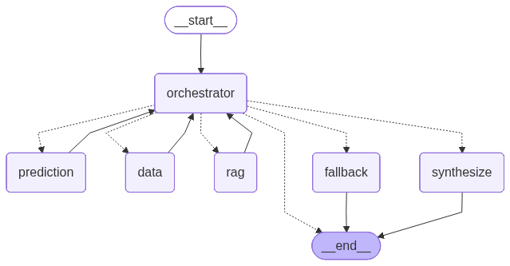

# Data Doctor Project Overview

## What This Project Covers

Data Doctor is an AI prototype for clinical analysts.  
It combines:

- **Tabular ML predictions** for:
  - `COPD` severity class (A/B/C/D)
  - `ALT` lab value regression
- **LLM-based extraction + synthesis** around deterministic ML results
- **LangGraph multi-agent orchestration** (guardrails → orchestrator → specialist agents)
- **FastAPI + Streamlit UI** (Chat via orchestrated graph; Form for direct ML)

Current implemented core:

- **Orchestration:** guardrails, hybrid routing (rules + LLM), `data` agent (SQL/DuckDB), stub `rag` / `fallback` routing
- **Prediction agent:** feature mapping, LLM extract → ML → LLM synthesis
- **Data agent:** LLM SQL extract → validated DuckDB query → LLM synthesis (SQL + table in `data_query` metadata for verification)
- Deterministic prediction response contract (LLM does not invent prediction values)
- LangGraph flow: `START -> orchestrator -> predict | data | rag | fallback -> END`

---

## Tech Stack

- Python 3.12+
- LangChain / LangGraph
- Pydantic / Pydantic Settings
- scikit-learn, XGBoost, LightGBM
- FastAPI, Streamlit
- DuckDB (planned SQL flow)

---

## Quick Start

From project root:

```bash
uv sync
uv sync --extra dev
```

---

## Environment Configuration

Create a local environment file:

```bash
cp .env.example .env
```

Minimal required fields:

```env
LLM_PROVIDER=openai
OPENAI_API_KEY=your-openai-api-key
```

If you want Anthropic instead:

```env
LLM_PROVIDER=anthropic
ANTHROPIC_API_KEY=your-anthropic-api-key
```

Optional LangSmith tracing:

```env
LANGCHAIN_TRACING_V2=false
LANGCHAIN_API_KEY=your-langsmith-api-key
LANGCHAIN_PROJECT=data-doctor
```

---

## Running and Testing

### Run unit tests

```bash
uv run pytest
```

Target only prediction agent tests:

```bash
uv run pytest tests/test_agents/test_prediction_agent.py -v
```

Target only LangGraph tests:

```bash
uv run pytest tests/test_agents/test_graph.py -v
```

### Run type checks

```bash
uv run pyright
```

---

## LangGraph Prediction Flow

Graph entry point: `src/agents/graph.py`

Flow:

```text
ChatRequest -> initial AgentState -> graph.invoke() -> final AgentState -> ChatResponse
```

Graph topology:

```text
START -> orchestrator -> predict | data | rag | fallback -> END
```

Diagram (committed for README/docs):



Regenerate after changing `src/agents/graph.py` (requires network — Mermaid API):

```bash
uv run python scripts/regenerate_graph_png.py
```

Writes `docs/assets/chat_graph.png`. Commit the updated image with your graph changes.

- `orchestrator` applies guardrails and routes to a specialist agent
- `predict` calls `run_prediction_agent` (LLM extract → ML → synthesis)
- `data` calls `run_data_agent` (LLM SQL → validated DuckDB query → LLM synthesis)
- `rag` calls `run_rag_agent` (retrieve → corrective grade → synthesis → grounding verify)
- `fallback` handles guardrail blocks, low-confidence routing, and unclear requests
- `run_chat_graph(request)` is the high-level helper used by API/UI

For orchestration testing, see **Testing Initial Orchestration** at the end of this document.
For runtime smoke testing, see **Runtime Smoke Tests** below.

---

## Runtime Smoke Tests

Use these scripts to verify real graph behavior (not mocked unit tests).

| Script | What it exercises |
|--------|-------------------|
| `scripts/smoke_chat_graph.py` | Full path: `ChatRequest -> LangGraph -> orchestrator -> specialist agent -> ChatResponse` |
| `scripts/smoke_prediction_agent.py` | Prediction agent only (bypasses orchestrator and graph routing) |
| `scripts/regenerate_graph_png.py` | Refresh `docs/assets/chat_graph.png` after graph topology changes |
| `scripts/index_documents.py` | Index `data/documents/*.md` into Chroma (`data/chroma/`) |

`smoke_chat_graph.py` prints JSON with `request`, **`routing`**, `response`, and `state_error`.  
A one-line routing summary is printed to **stderr** before the JSON.

### Prerequisites

1. Dependencies installed (`uv sync`)
2. For **prediction** and **data** routes: `.env` with a valid provider API key
3. For **prediction** routes: ML artifacts (`uv run python -m ml.train`)
4. For **data** routes: `data/raw/patient_data.csv` on disk
5. **rag / fallback** smoke via graph script: rule-based routing works without ML artifacts; **data** now also needs an LLM key for SQL generation

`POST /chat` via API still requires an LLM key for all routes until that check is relaxed.

### Shared output checks

| Field | Pass condition |
|-------|----------------|
| `state_error` | `null` for successful runs |
| `routing.routed_to` | `prediction`, `data`, `rag`, `multi`, or `fallback` |
| `routing.route_source` | `rules`, `llm`, or `guardrail` |
| `routing.agent_steps` | e.g. `["orchestrator:data", "data"]` |
| `response.session_id` | matches `--session-id` (or default `smoke-session`) |
| `response.text` | readable answer text |
| `response.prediction` | present for single-target **prediction** prompts |
| `response.predictions` | present for `both` prompts (`copd` + `alt`) |
| `response.prediction.can_predict` | `true` when required features are available |
| `response.prediction.defaults_used` | may be non-empty when optional fields are imputed |
| `response.data_query` | present for **data** routes (`sql`, `rows`, `row_count`) |
| `response.metadata.llm_model` | populated for prediction and data routes |
| `response.metadata.latency_ms` | positive number |

### Example prompts

- `Predict ALT for a patient with BMI 30`
- `Predict COPD for smoker with poor diet and low exercise`
- `I need both predictions for BMI 29, moderate exercise, middle income`
- `Predict COPD`
- `Show me a SQL query for readmissions by month`

### Test `smoke_chat_graph.py`

Basic run (prediction example — needs LLM + ML):

```bash
uv run python scripts/smoke_chat_graph.py
```

Built-in examples by route (`--expect-route` asserts `routing.routed_to`):

```bash
uv run python scripts/smoke_chat_graph.py --example data --expect-route data
uv run python scripts/smoke_chat_graph.py --example rag --expect-route rag
uv run python scripts/smoke_chat_graph.py --example fallback --expect-route fallback
uv run python scripts/smoke_chat_graph.py --example clarify --expect-route fallback
```

Custom message:

```bash
uv run python scripts/smoke_chat_graph.py --message "Predict ALT for a patient with BMI 30"
```

Custom session id:

```bash
uv run python scripts/smoke_chat_graph.py --message "Predict COPD for smoker with poor diet and low exercise" --session-id demo-1
```

Run `uv run python scripts/smoke_chat_graph.py --help` for all example prompts.

Suggested manual cases:

```bash
uv run python scripts/smoke_chat_graph.py --message "Predict ALT for a patient with BMI 30" --session-id t1 --expect-route prediction
uv run python scripts/smoke_chat_graph.py --message "Predict COPD for smoker with poor diet and low exercise" --session-id t2 --expect-route prediction
uv run python scripts/smoke_chat_graph.py --message "I need both predictions for BMI 29, moderate exercise, middle income" --session-id t3 --expect-route prediction
uv run python scripts/smoke_chat_graph.py --message "Predict COPD" --session-id t4 --expect-route prediction
uv run python scripts/smoke_chat_graph.py --example data --session-id t5 --expect-route data
uv run python scripts/smoke_chat_graph.py --example rag --session-id t6 --expect-route rag
uv run python scripts/smoke_chat_graph.py --example fallback --session-id t7 --expect-route fallback
```

Expected by case:

- **t1/t2:** `state_error = null`, `routing.routed_to = prediction`, `can_predict = true`
- **t3:** `response.predictions` contains both `copd` and `alt`
- **t4:** clarification text or `can_predict = false` with `missing_required`
- **t5:** `routing.routed_to = data`, `response.data_query` populated with real SQL rows
- **t6:** `routing.routed_to = rag`, RAG stub text
- **t7:** `routing.routed_to = fallback`, `routing.guardrail_blocked = true` on guardrail example

### Test `smoke_prediction_agent.py`

Basic run:

```bash
uv run python scripts/smoke_prediction_agent.py
```

Custom message:

```bash
uv run python scripts/smoke_prediction_agent.py --message "Predict ALT for a patient with BMI 30"
```

Custom session id:

```bash
uv run python scripts/smoke_prediction_agent.py --message "Predict COPD for smoker with poor diet and low exercise" --session-id demo-1
```

Use the prediction manual cases (`t1`–`t4`) above; expected output shape is the same JSON contract but **without** a top-level `routing` block and without orchestrator steps.

Difference vs graph smoke test: this script calls `run_prediction_agent` directly, so it is useful when debugging prediction logic without LangGraph wiring.

### Common failure signals

- `state_error` contains API key/config errors -> check `.env` (`LLM_PROVIDER`, key variables)
- `FileNotFoundError` for model artifacts -> run `uv run python -m ml.train`
- empty `response.text` -> inspect provider/model settings in `src/config.py`

---

## Running the API

API entry point: `src/api/main.py`

Endpoints:

- `GET /health` — readiness check (`llm_configured`, `ml_models_loaded`)
- `POST /chat` — natural-language chat routed through LangGraph

### Prerequisites

1. Dependencies installed (`uv sync`)
2. `.env` configured with provider API key
3. ML artifacts available (if missing: `uv run python -m ml.train`)

### Start server

From project root:

```bash
uv run uvicorn api.main:app --reload --app-dir src
```

Default URL: `http://localhost:8000`, 
Swagger UI (interactiv testing): `http://localhost:8000/docs`

On startup, API preloads ML models (if artifacts exist) and compiles the LangGraph instance.

### Health check

```bash
curl http://localhost:8000/health
```

Expected fields:

- `status`: `ok`, `degraded`, or `error`
- `api`: `up`
- `llm_configured`: `true` when provider key is set
- `ml_models_loaded`: `true` when COPD/ALT artifacts were loaded

### Chat request

```bash
curl -X POST http://localhost:8000/chat \
  -H "Content-Type: application/json" \
  -d '{"message":"Predict ALT for a patient with BMI 30","session_id":"api-demo-1"}'
```

Request body (`ChatRequest`):

```json
{
  "message": "Predict ALT for a patient with BMI 30",
  "session_id": "api-demo-1",
  "user_id": "default-user"
}
```

`session_id` and `user_id` are optional (defaults are generated/used by schema).

### API tests

```bash
uv run pytest tests/test_api/test_chat.py -v
```

### Common API issues

- `503` on `/chat` with missing LLM key -> configure `.env` (`LLM_PROVIDER` + provider key)
- `degraded` on `/health` -> usually missing LLM key or ML artifacts
- model artifact errors -> run `uv run python -m ml.train`

---

## Running the Streamlit UI

UI entry point: `ui/app.py`

The UI has two tabs:

- **Chat** — sends natural-language messages to `POST /chat` (full E2E via API + LangGraph)
- **Form (v0)** — direct ML inference from structured fields (no LLM)

### Step-by-step startup

**Terminal 1 — start API:**

```bash
uv run uvicorn api.main:app --reload --app-dir src
```

**Terminal 2 — start Streamlit UI:**

```bash
uv run streamlit run ui/app.py
```

**Browser:**

- UI: `http://localhost:8501`
- API docs (optional): `http://localhost:8000/docs`

### Prerequisites

1. Dependencies installed (`uv sync`)
2. `.env` configured with provider API key (required for **Chat** tab)
3. ML artifacts available (if missing: `uv run python -m ml.train`)

### First run checklist

1. Open `http://localhost:8501`
2. In sidebar, keep API URL as `http://localhost:8000` (unless you changed API port)
3. Click **Check /health**
4. Confirm:
   - `llm_configured: true` (for Chat tab)
   - `ml_models_loaded: true` (for Chat + Form tab)
5. Go to **Chat** or **Form** tab and run examples below

### Chat tab examples

Type these prompts in the chat input:

- `Predict ALT for a patient with BMI 30`
- `Predict COPD for smoker with poor diet and low exercise`
- `I need both predictions for BMI 29, moderate exercise, middle income`
- `Predict COPD` (clarification / missing fields case)
- `How many patients are in each income bracket?` (routes to data agent)

Expected behavior:

- assistant text appears in chat history
- for prediction prompts: prediction block with value/class
- expandable sections may show `defaults_used`, `missing_required`, `top_global_factors`
- disclaimer shown at the bottom of prediction details

### Form tab examples

Form fields change by target. Required fields start empty; prediction is blocked until they are filled.

**ALT example** (`alt` fields)

- BMI: `30` (required — must be entered manually)
- Optional fields (`diet_quality`, `exercise_frequency`, etc.) can be left empty or filled explicitly

Open **Training-data reference values** in the Form tab to see typical values from the training dataset (informational only).

Expected behavior:

- result appears immediately (no LLM call)
- single target -> one prediction block
- `both` -> separate COPD and ALT blocks

### Session controls (sidebar)

- **Check /health** — verifies API readiness
- **New session** — clears chat history and creates a new `session_id`

Chat history is kept only in the current browser session (`st.session_state`), not on the server.

### Common UI issues

- `Could not reach API` -> API is not running, or wrong API URL in sidebar
- `API error (503)` on Chat -> missing LLM key in `.env`
- Form tab error about model artifacts -> run `uv run python -m ml.train`
- Health shows `degraded` -> usually missing LLM key and/or ML artifacts

---

## Testing Initial Orchestration

The orchestration slice routes each `/chat` message through guardrails and the orchestrator before calling a specialist agent.

```text
START -> orchestrator -> predict | data | rag | fallback -> END
```

Check `response.metadata` for routing transparency:

| Field | Meaning |
|-------|---------|
| `routed_to` | Specialist that handled the message (`prediction`, `data`, `rag`, `multi`, `fallback`) |
| `route_confidence` | Orchestrator confidence (0–1) |
| `route_source` | `rules`, `llm`, or `guardrail` |
| `guardrail_blocked` | `true` when input was blocked before routing |

In Streamlit, routing also appears under each assistant reply and in the sidebar **Last routing** panel.

### 1. Automated tests (no LLM required)

Fastest way to verify routing logic:

```bash
uv run pytest tests/test_agents/test_graph.py tests/test_agents/test_orchestrator.py tests/test_agents/test_guardrails.py -v
```

Or use the smoke script without an API key for stub routes:

```bash
uv run python scripts/smoke_chat_graph.py --example data --expect-route data
```

These tests mock the prediction agent and exercise rule-based routing, guardrails, and graph wiring.

### 2. Manual API tests (real E2E)

**Prerequisites:** API running (`uv run uvicorn api.main:app --reload --app-dir src`).

**Important:** `POST /chat` currently requires an LLM API key in `.env` for all routes, even data/rag/fallback stubs. Without a key you get `503`.

Check readiness first:

```bash
curl -s http://localhost:8000/health | python3 -m json.tool
```

#### A) SQL message → `data` stub

```bash
curl -s -X POST http://localhost:8000/chat \
  -H "Content-Type: application/json" \
  -d '{"message":"Show me a SQL query for readmissions by month","session_id":"test-data"}' \
  | python3 -m json.tool
```

**Expected:**

- `metadata.routed_to` = `"data"`
- `metadata.route_source` = `"rules"` (keyword match)
- `prediction` = `null`
- `data_query` contains SQL + result rows

#### B) Guardrail block → `fallback`

```bash
curl -s -X POST http://localhost:8000/chat \
  -H "Content-Type: application/json" \
  -d '{"message":"What medication should the patient take for COPD?","session_id":"test-guard"}' \
  | python3 -m json.tool
```

**Expected:**

- `metadata.routed_to` = `"fallback"`
- `metadata.guardrail_blocked` = `true`
- `prediction` = `null`
- `text` explains the request is out of scope

#### C) Document search → `rag` stub

```bash
curl -s -X POST http://localhost:8000/chat \
  -H "Content-Type: application/json" \
  -d '{"message":"What does the COPD guideline say about exercise?","session_id":"test-rag"}' \
  | python3 -m json.tool
```

**Expected:**

- `metadata.routed_to` = `"rag"`
- `text` mentions the RAG agent stub

#### D) Prediction → `prediction` agent

```bash
curl -s -X POST http://localhost:8000/chat \
  -H "Content-Type: application/json" \
  -d '{"message":"Predict ALT for a patient with BMI 30","session_id":"test-pred"}' \
  | python3 -m json.tool
```

**Expected:**

- `metadata.routed_to` = `"prediction"`
- `prediction` object present with `can_predict`, `prediction` value, etc.

**Also requires:** `llm_configured: true` and `ml_models_loaded: true` on `/health`.

### 3. Swagger UI (click-through)

1. Open `http://localhost:8000/docs`
2. Expand `POST /chat` → **Try it out**
3. Example body:

```json
{
  "message": "Show me a SQL query for readmissions by month",
  "session_id": "swagger-1"
}
```

4. **Execute** and inspect `metadata.routed_to` in the response.

### 4. Streamlit UI

**Terminal 1 — API:**

```bash
uv run uvicorn api.main:app --reload --app-dir src
```

**Terminal 2 — UI:**

```bash
uv run streamlit run ui/app.py
```

Open `http://localhost:8501` → **Chat** tab. Try the same prompts as in section 2.

**What to look for:**

- Under each assistant reply: `routed: data | confidence: … | via rules`
- Sidebar **Last routing**: JSON with `routed_to`, `route_confidence`, `route_source`, `guardrail_blocked`

### What works without an LLM key?

| Test method | Works without LLM key? |
|-------------|------------------------|
| `pytest` (orchestrator/graph/guardrails) | **Yes** |
| `curl` / Swagger / Streamlit Chat | **No** — `/chat` returns `503` without provider credentials |
| Streamlit **Form** tab | **Yes** — direct ML, no LLM |

### Quick reference — example prompts

| Prompt | Expected `routed_to` | Notes |
|--------|----------------------|-------|
| `Predict ALT for a patient with BMI 30` | `prediction` | Needs LLM + ML artifacts |
| `Show me a SQL query for readmissions by month` | `data` | Needs LLM + patient CSV; may ask for clarification (no month column) |
| `How many patients are in each income bracket?` | `data` | Needs LLM + patient CSV |
| `What is the average BMI for each diet quality group?` | `data` | `AVG(bmi)` + `GROUP BY diet_quality` (3 rows) |
| `Compare readmission rates between smokers and non-smokers` | `data` | Groups by `smoker`; uses `readmitted` flag |
| `For each exercise frequency level, show the count of patients in each COPD severity class` | `data` | Multi-column `GROUP BY`; uses `chronic_obstructive_pulmonary_disease` |
| `What is the average number of days hospitalized for urban vs rural patients with poor diet quality?` | `data` | `WHERE` + `GROUP BY urban` |
| `Among high-income patients, which diagnosis codes are most common?` | `data` | Filter + `GROUP BY diagnosis_code` + sort |
| `What low-impact exercise is recommended in treatment plans?` | `rag` | Should return citations (see RAG table #1) |
| `Summarize lifestyle recommendations including diet and exercise from the clinical documents` | `rag` | Summarize across docs (RAG table #4) |
| `What does the COPD guideline say about exercise?` | `rag` | Routes to RAG; likely no relevant docs (RAG table #8) |
| `What medication should the patient take for COPD?` | `fallback` | Guardrail block |
| `hello there` | `fallback` | Low confidence / clarification |

---

## RAG Agent (Phase 3) — Example prompts

RAG searches indexed markdown in `data/documents/` via Chroma (corrective grading + grounding verify).  
The corpus is synthetic clinical notes — **not** formal COPD/ALT guideline libraries. Prompts marked **No** test honest “not in documents” behavior.

**Prerequisites:** LLM API key, `data/documents/*.md`, indexed vector store (`data/chroma/`).

```bash
uv run python scripts/index_documents.py
uv run python scripts/index_documents.py --reset   # rebuild collection from scratch
```

Requires `OPENAI_API_KEY` in `.env` (embeddings use `text-embedding-3-small`).

| # | Example prompt | In corpus? | What it exercises |
|---|----------------|------------|-------------------|
| 1 | `What low-impact exercise is recommended in treatment plans?` | **Yes** | Treatment-plan retrieval; rules routing; citations |
| 2 | `What exercise recommendations appear in documents about rheumatology or joint pain?` | **Yes** | Topic-focused search (e.g. hydroxychloroquine / joint pain notes) |
| 3 | `What does the treatment plan say about smoking cessation counseling?` | **Yes** | Smoking / counseling snippets in treatment plans |
| 4 | `Summarize lifestyle recommendations including diet and exercise from the clinical documents` | **Yes** | Broad summarize; query expansion; keyword fallback |
| 5 | `What hydroxychloroquine recommendations appear in treatment plans?` | **Yes** | Medication-focused document search |
| 6 | `What recommendations are given for balanced diet and regular exercise in clinical documents?` | **Yes** | Diet + exercise cross-document synthesis |
| 7 | `What gentle exercise programs are documented for patients with fatigue or muscle weakness?` | **Yes** | Symptom-specific lifestyle retrieval |
| 8 | `What does the COPD guideline say about exercise?` | **No** | Routes to RAG; expect no relevant chunks (no COPD text in corpus) |
| 9 | `Summarize the ALT monitoring document with citations` | **No** | Routes to RAG; no dedicated ALT monitoring doc — “not in documents” |
| 10 | `What does our readmission follow-up policy say after discharge?` | **No** | Routes to RAG; no formal policy docs — graceful no-answer |

**Smoke / curl:**

```bash
uv run python scripts/smoke_chat_graph.py --example rag --expect-route rag
uv run python scripts/smoke_chat_graph.py \
  --message "What low-impact exercise is recommended in treatment plans?" \
  --expect-route rag
```

See also `docs/RAG.md` for implementation details and troubleshooting.

### Architecture sketch (internal pipeline)

Phase 3 keeps **one** `rag` node in the main LangGraph. Corrective grading and self-grounding run **inside** `run_rag_agent` as a function pipeline (same style as `data_agent`), not as new top-level graph nodes.

```text
run_rag_agent(AgentState)
  │
  ├─ retrieve_chunks()        # Chroma top-k (default k=5), no LLM
  ├─ grade_chunks()           # corrective RAG: LLM relevance per chunk
  ├─ if no relevant chunks → not_found_response()
  ├─ synthesize_answer()      # LLM answer from filtered chunks + citations
  ├─ verify_grounding()       # self-RAG lite: is answer supported by chunks?
  └─ if not grounded && retry_count < 1 → synthesize_answer(strict=True) once more
     else if still not grounded → safe_fallback_response()
```

Optional later: refactor the same steps into a **RAG sub-graph** without changing `graph.py` or the public `run_rag_agent` signature.

#### Internal flow

```text
user_message
    → retrieve top-5 chunks (Chroma)
    → grade each chunk: relevant? yes/no
    → keep only relevant chunks (0..5)
    → if none: "We don't have relevant information in the indexed documents."
    → synthesize prose answer (only from kept chunks)
    → verify: grounded in those chunks?
         → yes  → return answer + citations in metadata
         → no   → one strict retry, then admit uncertainty / not in documents
```

#### Packaging

| Layer | Responsibility |
|-------|----------------|
| `src/data/vectorstore.py` | Index `data/documents/*.md`, Chroma search |
| `src/agents/tools/rag_retrieval.py` | Thin wrapper: `retrieve_chunks(query, k)` |
| `src/agents/subagents/rag_agent.py` | Pipeline orchestration: `run_rag_agent` + step functions |
| `src/schemas/citation.py` | `Citation`, `RetrievedChunk` |
| `src/schemas/rag.py` | `RAGQueryResult`, LLM structured outputs for grade/verify |
| `src/agents/state.py` | `rag_result` on shared `AgentState` |
| `src/schemas/chat.py` | `ChatRAGDetails` on `ChatResponse` |
| `ui/app.py` | Expander for citations (parallel to `data_query`) |

#### Schemas (`src/schemas/citation.py`)

```python
class Citation(BaseModel):
    source_file: str
    section_name: str
    snippet: str
    score: float | None = None          # retrieval score from Chroma

class RetrievedChunk(BaseModel):
    chunk_id: str
    source_file: str
    section_name: str
    content: str
    score: float
    relevant: bool | None = None        # set after grade_chunks()
    relevance_reason: str | None = None
```

#### Schemas (`src/schemas/rag.py`)

```python
RAG_DISCLAIMER = "Internal prototype — answers from indexed clinical documents only. Not clinical advice."

class LLMChunkGrade(BaseModel):
    chunk_id: str
    relevant: bool
    reason: str = ""

class LLMChunkGradingResult(BaseModel):
    grades: list[LLMChunkGrade]

class LLMGroundingCheck(BaseModel):
    grounded: bool
    unsupported_claims: list[str] = Field(default_factory=list)
    reasoning: str = ""

class RAGQueryResult(BaseModel):
    user_message: str
    retrieved_count: int
    relevant_count: int
    citations: list[Citation]
    chunks_used: list[RetrievedChunk]   # only relevant chunks passed to synthesis
    grounded: bool
    grounding_retry_count: int = 0
    disclaimer: str = RAG_DISCLAIMER
```

#### Shared graph state (`AgentState`)

```python
# Added to AgentState (dict on wire, like data_result):
rag_result: dict[str, Any]   # RAGQueryResult.model_dump()

# Helpers (mirror set_data_result / get_data_result):
def set_rag_result(state, result: RAGQueryResult) -> AgentState: ...
def get_rag_result(state) -> RAGQueryResult | None: ...
```

#### Chat API (`ChatResponse`)

```python
class ChatRAGDetails(BaseModel):
    retrieved_count: int
    relevant_count: int
    citations: list[Citation]
    grounded: bool
    disclaimer: str = RAG_DISCLAIMER

# ChatResponse field:
rag: ChatRAGDetails | None = None
```

`response.text` = synthesized prose (primary chat message).  
`response.rag` + UI expander = sources for verification (like `data_query` for SQL).

#### Function signatures (`rag_agent.py`)

```python
def run_rag_agent(state: AgentState) -> AgentState:
    """LangGraph node entry: full RAG pipeline."""

def retrieve_chunks(user_message: str, *, k: int = 5) -> list[RetrievedChunk]:
    """Chroma similarity search via rag_retrieval tool."""

def grade_chunks(user_message: str, chunks: list[RetrievedChunk]) -> list[RetrievedChunk]:
    """Corrective RAG: LLM marks each chunk relevant/not; returns filtered list."""

def synthesize_rag_answer(
    user_message: str,
    chunks: list[RetrievedChunk],
    *,
    strict: bool = False,
) -> str:
    """LLM synthesis from read-only chunk JSON; strict=True on grounding retry."""

def verify_grounding(
    user_message: str,
    answer: str,
    chunks: list[RetrievedChunk],
) -> LLMGroundingCheck:
    """Self-RAG lite: check answer against the same chunks used for synthesis."""

def build_rag_facts_payload(...) -> dict[str, Any]:
    """Read-only JSON for synthesis / verify prompts (no invented text)."""

def not_found_response() -> str: ...
def safe_fallback_response(check: LLMGroundingCheck) -> str: ...
```

#### Config (defaults in `src/config.py`)

```python
rag_top_k: int = 5
rag_min_relevant_chunks: int = 1
rag_max_grounding_retries: int = 1
```

#### Expected API / UI behavior (after implementation)

- `metadata.routed_to` = `"rag"`
- `response.text` = natural-language answer grounded in documents, or explicit “not in documents”
- `response.rag` = citation metadata (`source_file`, `section_name`, `snippet`, `grounded`)
- Streamlit expander: **Sources** with excerpts (like SQL expander for data agent)

#### Implementation order

1. `citation.py` + `rag.py` schemas  
2. `vectorstore.py` + `scripts/index_documents.py`  
3. `rag_retrieval.py` tool  
4. `rag_agent.py` pipeline (`retrieve` → `grade` → `synthesize` → `verify`)  
5. `state.py` + `chat.py` + UI expander  
6. Tests (mock retrieval + grade + verify)  
7. Docs / smoke with real documents  

---

## Multi-step Orchestrator (Phase 5) — Example prompts

One user message can trigger **multiple specialist agents** in a single `/chat` call. The orchestrator loops until all required work is done, then **synthesizes** when **2+** agents ran. The user still sees **one** assistant reply.

```text
START → orchestrator → agent(s) → orchestrator → synthesize? → END
```

| Parameter | Value |
|-----------|-------|
| Max specialist agents per message | **3** (`data`, `prediction`, `rag`) |
| `synthesize` | Only when **≥ 2** specialists completed |
| Single agent | `finish` → END (no synthesize) |
| `routed_to: multi` | When 2+ agents ran or answer was synthesized |

**Prerequisites:** LLM API key; `patient_data.csv` for **data** routes; ML artifacts for **prediction**; indexed Chroma for **rag**.

```bash
uv run pytest tests/test_agents/test_multi_step.py tests/test_agents/test_multi_step_graph.py -v
```

More detail: `docs/MULTI_ORCHESTRATION.md`.

### Quick reference — `routed_to`

| `routed_to` | Meaning |
|-------------|---------|
| `data` / `prediction` / `rag` | Single specialist agent |
| `multi` | 2+ agents + synthesize |
| `fallback` | Guardrail block or unclear request |

### 10 manual test cases

Use in Streamlit **Chat** or via smoke script (`--session-id` optional):

```bash
uv run python scripts/smoke_chat_graph.py --message "<prompt>" --session-id test-multistep-N
```

#### 1. Single agent — data only

**Prompt:** `How many patients are in each income bracket?`

| Expectation | |
|-------------|--|
| Agents | `data` only |
| `routed_to` | `data` |
| Synthesize | **No** — `finish` |
| Response | SQL + table/counts; **Data query details** expander populated |
| `agent_steps` | `orchestrator:data` → `data` → orchestrator (finish) |

#### 2. Single agent — prediction only

**Prompt:** `Predict ALT for a patient with BMI 30`

| Expectation | |
|-------------|--|
| Agents | `prediction` only |
| `routed_to` | `prediction` |
| Synthesize | **No** |
| Response | ALT value + `prediction` metadata |

#### 3. Single agent — RAG only

**Prompt:** `What does the COPD guideline say about exercise?`

| Expectation | |
|-------------|--|
| Agents | `rag` only |
| `routed_to` | `rag` |
| Synthesize | **No** |
| Response | Document-based text + citations (or honest “not in documents” if corpus has no match) |
| Note | Run `uv run python scripts/index_documents.py` first |

#### 4. Multi-step — data + prediction (classic combo)

**Prompt:** `Compare average BMI in the dataset with ALT prediction for BMI 30`

| Expectation | |
|-------------|--|
| Agents | `data` → `prediction` → **synthesize** |
| `routed_to` | `multi` |
| Synthesize | **Yes** — one combined answer |
| Response | Average BMI from SQL + ALT prediction in one message |
| Metadata | Both `data_query` and `prediction` populated |
| Order | `data` first, then `prediction` |
| SQL check | `FROM patients` with `AVG(bmi)` — not a hallucinated table like `avg_bmi` |

```bash
uv run python scripts/smoke_chat_graph.py \
  --message "Compare average BMI in the dataset with ALT prediction for BMI 30" \
  --session-id test-multistep-4
```

#### 5. Multi-step — data + RAG

**Prompt:** `What is the average BMI in the dataset and what do documents recommend for low-impact exercise?`

| Expectation | |
|-------------|--|
| Agents | `data` → `rag` → synthesize |
| `routed_to` | `multi` |
| Synthesize | **Yes** |
| Response | Dataset metric + document recommendations |
| Metadata | `data_query` + `rag` |

#### 6. Multi-step — prediction + RAG (no SQL)

**Prompt:** `Predict COPD for good diet and moderate exercise, and summarize what the guideline says about diet`

| Expectation | |
|-------------|--|
| Agents | `prediction` → `rag` → synthesize |
| `routed_to` | `multi` |
| Synthesize | **Yes** |
| Response | COPD class + document summary |
| Note | No `data` — no analytics signals (`average`, `count`, `group by`, etc.) |

#### 7. Multi-step — all three agents (max combo)

**Prompt:** `Compare average BMI in the dataset, predict ALT for BMI 30, and what do documents say about exercise?`

| Expectation | |
|-------------|--|
| Agents | `data` → `prediction` → `rag` → synthesize |
| `routed_to` | `multi` |
| Synthesize | **Yes** |
| Response | One text covering all three sources |
| Session ledger | 3+ `StepRecord` entries (data, prediction, rag; optional synthesis) |
| Limit | 3 specialist agents — upper bound for MVP |

#### 8. Fallback — guardrail

**Prompt:** `What medication should the patient take for COPD?`

| Expectation | |
|-------------|--|
| Agents | `fallback` only |
| `routed_to` | `fallback` |
| `guardrail_blocked` | `true` |
| Synthesize | **No** |
| Response | Blocked / out-of-scope message |
| Loop | None — fallback goes directly to END |

#### 9. Fallback — ambiguous question

**Prompt:** `Tell me something interesting about patients`

| Expectation | |
|-------------|--|
| Agents | `fallback` |
| `routed_to` | `fallback` |
| Synthesize | **No** |
| Response | Help text or clarification (`requires_clarification`) |
| Reason | No clear data / prediction / rag signals |

#### 10. Single agent — data (“compare” without multi-step)

**Prompt:** `Compare readmission counts by month`

| Expectation | |
|-------------|--|
| Agents | `data` only |
| `routed_to` | `data` |
| Synthesize | **No** — “compare” alone does not imply multi-step |
| Response | SQL aggregation (may ask for clarification — no month column in dataset) |
| Note | Multi-step needs **multiple task types** in one message (analytics + prediction and/or documents) |

### Bonus — session memory (not multi-step)

Two messages in the **same** `session_id` (Phase 4 memory, not multi-agent in one turn):

1. `Predict ALT for BMI 28`
2. `What if BMI is 35?`

| Expectation | |
|-------------|--|
| Second `routed_to` | `prediction` (follow-up rule) |
| Not | `multi` — only one agent per message |
| Behavior | `last_features` merged; BMI 35 used in second prediction |

Use **New session** in Streamlit to verify isolation between sessions.

### Summary table

| # | Prompt (short) | Expected `routed_to` | Synthesize? |
|---|----------------|----------------------|-------------|
| 1 | Patients per income bracket | `data` | No |
| 2 | Predict ALT BMI 30 | `prediction` | No |
| 3 | COPD guideline exercise | `rag` | No |
| 4 | Compare avg BMI + ALT BMI 30 | `multi` | Yes |
| 5 | Avg BMI + low-impact exercise docs | `multi` | Yes |
| 6 | Predict COPD + guideline diet | `multi` | Yes |
| 7 | BMI + ALT + exercise docs | `multi` | Yes |
| 8 | Medication for COPD | `fallback` | No |
| 9 | Something interesting | `fallback` | No |
| 10 | Compare readmissions by month | `data` | No |

---

## End-to-end system test prompts (assignment checklist)

Use these prompts to validate the full Data Doctor stack: ML models, dataset SQL, RAG over indexed documents, orchestration, and the Streamlit/API chat interface.

### Your system should:

- Understand the dataset and surface insights about patient risk factors, potential interventions, and feature patterns.
- Build models to predict patients’ `chronic_obstructive_pulmonary_disease` and `alanine_aminotransferases`.
- Enable a conversational interface that can answer both data-specific and document-based queries like:

**Prerequisites:** API + UI running, `.env` with LLM key, `uv run python -m ml.train`, `data/raw/patient_data.csv`, and `uv run python scripts/index_documents.py` for RAG prompts.

| # | Prompt | Expected `routed_to` | What to verify |
|---|--------|----------------------|----------------|
| 1 | What is the predicted value for chronic_obstructive_pulmonary_disease for 55 year old male with bmi of 27.5, which takes 3 medications, doesn’t exercise, and have poor diet quality? | `prediction` | `response.prediction` with COPD class; features extracted (BMI, diet, exercise, sex, medication_count); disclaimer present |
| 2 | What is the predicted value for alanine_aminotransferases for woman at 44 years, that has been in a hospital for 5 days, readmitted, athlete that lives in the center of the city? | `prediction` | ALT numeric prediction; `used_features` / `defaults_used` in metadata; may impute fields not in the message |
| 3 | How many smokers are in the dataset? | `data` | SQL over `patients`; **Data query details** expander with `smoker` aggregation |
| 4 | How many males older then 40 are readmitted? | `data` | SQL with `sex`, `age`, `readmitted` filters; row count in `data_query` |
| 5 | What medications was the heart attack patient taking? | `rag` | Document search + citations; honest “not in documents” if corpus has no heart-attack medication list |
| 6 | How many patients were taking more than 5 medications? | `data` | SQL on `medication_count > 5`; numeric count in response |
| 7 | What are the symptoms of seasonal allergies? | `rag` | Routes to RAG (not fallback); citations or explicit not-found if corpus lacks symptom text |
| 8 | Summarize the treatment plan for diabetic patients over 60. | `rag` | Treatment-plan chunks + summary; **Document sources** expander |
| 9 | Compare lab results across readmitted vs non-readmitted patients | `data` | SQL comparing cohorts (e.g. `readmitted` groups + lab columns); not RAG — this is CSV analytics |

### Full prompt text (copy-paste)

1. `What is the predicted value for chronic_obstructive_pulmonary_disease for 55 year old male with bmi of 27.5, which takes 3 medications, doesn’t exercise, and have poor diet quality?`

2. `What is the predicted value for alanine_aminotransferases for woman at 44 years, that has been in a hospital for 5 days, readmitted, athlete that lives in the center of the city?`

3. `How many smokers are in the dataset?`

4. `How many males older then 40 are readmitted?`

5. `What medications was the heart attack patient taking?`

6. `How many patients were taking more than 5 medications?`

7. `What are the symptoms of seasonal allergies?`

8. `Summarize the treatment plan for diabetic patients over 60.`

9. `Compare lab results across readmitted vs non-readmitted patients`

### Smoke script (optional)

```bash
uv run python scripts/smoke_chat_graph.py \
  --message "How many smokers are in the dataset?" \
  --expect-route data \
  --session-id e2e-smokers

uv run python scripts/smoke_chat_graph.py \
  --message "What are the symptoms of seasonal allergies?" \
  --expect-route rag \
  --session-id e2e-allergies
```

### Notes

- **Prediction** prompts need trained COPD/ALT artifacts and an LLM for feature extraction.
- **Data** prompts need `patient_data.csv`; some assignment wording (e.g. “hospital for 5 days”) may map to defaults or nearest schema columns (`days_in_hospital`, `urban`, etc.).
- **RAG** prompts need indexed `data/documents/`; answers are limited to indexed content — general medical facts not in the corpus should return grounded “not found” style responses, not fallback help text.
- **Insights / risk factors** (first bullet in “Your system should”) are partially covered by SHAP artifacts and future insight tooling; chat today routes through prediction, data, or rag as above.

